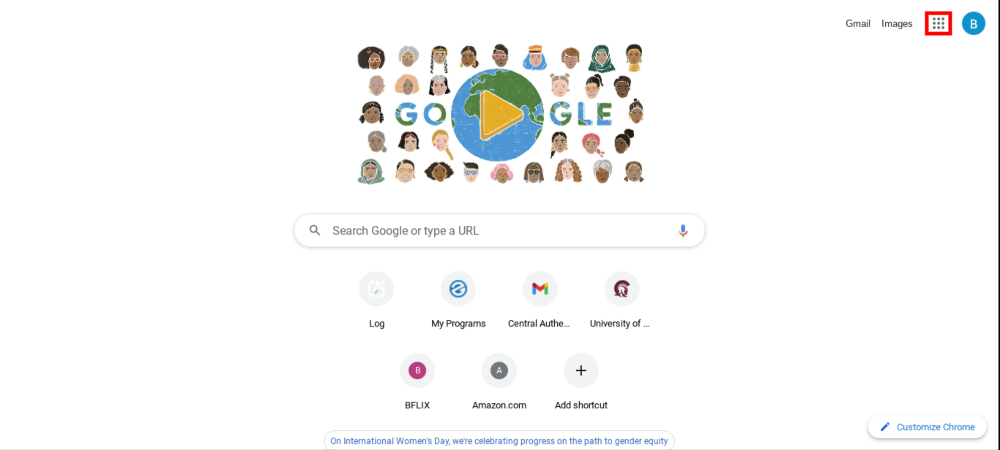
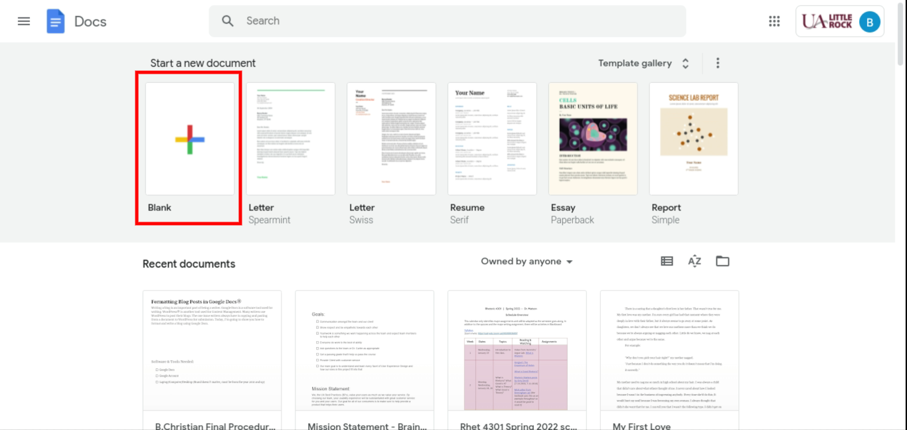
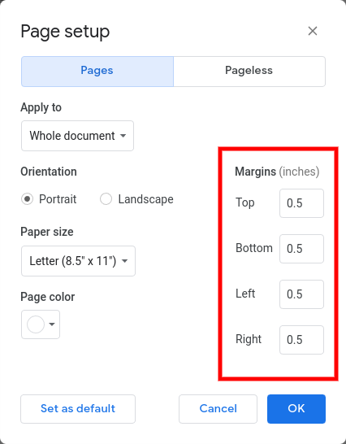

# Formatting Blog Posts in Google Docs

Writing a blog is an important part of being a writer. Google Docs is a software tool used for writing. WordPress is another tool used for content management. Many writers use WordPress to post their blogs. The one issue writers always have is copying and pasting from a document to WordPress for submission. 

Today, I'm going to show you how to format and write a blog using Google Docs.

## Software Tools Needed

- [ ] Google Docs
- [ ] Google Account
- [ ] Laptop/Computer/Desktop (Brand doesn't matter, must be from the year 2010 and up)

## Intended Audience

My intended audience is writers who use Google Docs to write blog posts. I know that some of you use WordPress to post these blog posts. 

Here's how to format your blog in Google Docs so that it transfers onto WordPress much easier.

**1. Log into your Google Account**
      
|Don't Have a Google Account? | Go to this website: https://www.google.com/account/about/|
|-----------------------------|----------------------------------------------------------|

**2. Click the nine dots in the corner of the screen**

###### Caption: "New Tab" Page of Google. Red Square is the Google Apps icon you should click on.

**3. Click on Docs to open the Google Docs homepage**

**4. To start a new page, click on the blank sheet with a multicolored plus sign**

|Already Have your Blog Started? | Find your blog in the "Recent documents" part of the page|
|--------------------------------|--------------------------------------------------------|

###### Caption: Homepage of Google Docs. Red Square is the Blank Document you should click on unless you've already started a blog.

**5. Once the page is loaded, click "file" under the document name**

###### Caption: Tabs Under Title of Document. Red Square indicates where "File" is located.

**6. Scroll and click "Page Setup"**

**7. Change all margins from "1.0" to "0.5"**

###### Caption: This is Page Setup. Red Square represents the margins of which they should be in.

**8. After setting your margins, click "OK"**

**9. Create your title by selecting "normal text" to expand the style list and select "Title"**

###### Caption: Document tools. Red Square indicates  the type of text you're on.

                                                                ⬇️
                                                                

###### Caption: Document tools. Red Square indicates the type of text you're on.

**10. Click "Insert" under the document name**

###### Caption: Tabs Under Document Title. Red Square indicates where "Insert" is located.

**11. Click "Horizontal line" to place it under the title**

**12. Write the rest of your blog post**

**13. Take the cursor and highlight your entire blog to copy it**

**14. Paste the blog onto your WordPress post**
